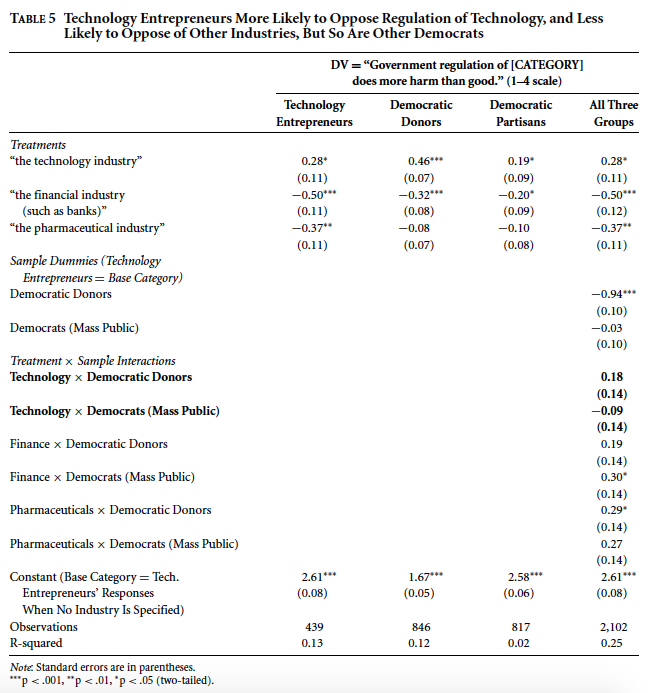

```{r setup, include=FALSE}
knitr::opts_chunk$set(echo = F, eval = F, cache = T)

library(bookdown)
library(fs)
library(ggrepel)
library(grid)
library(gridExtra)
library(haven)
library(kableExtra)
library(knitr)
library(labelled)
library(mice)
library(naniar)
library(plyr)
library(png)
library(reshape)
library(scales)
library(stargazer)
library(stringr)
library(tidyr)
library(tidyverse)

# Clean data for replication

source("prep_data.R")

# Create folder to hold all replicated figures; will be empty unless 
# Eval switched to T so that appendix runs 

dir_create("figures") 

```

# Abstract

Broockman, Ferenstein, and Malhotra (2019) show that technology entrepreneurs have a unique set of political beliefs: they are liberal on social issues, globalism, and redistribution, but very conservative on government regulation. The replication succeeded in generating these results. An extension that used linear regression to formally test whether certain values or predispositions, such as cosmopolitanism and authoritarianism, could predict policy preferences in particular domains, such as support for globalism and social issues, added support to the authors' ultimate claim that tech entrepreneurs' unique political beliefs stem from unique underlying philosophical values. Analyzing technology elites' political beliefs is an increasingly timely task as the tech industry becomes more influential in politics.

# Introduction

Broockman, Ferenstein, and Malhotra (2019) describe the political behavior of technology elites, who are growing increasingly wealthy and politically influential. They use four original surveys -- of technology entrepreneurs in which the modal respondent is a millionaire who founded or runs a tech industry company with around 100 employees; of partisan donors with an oversample of top 1\% donors; and subsamples of wealthy individuals and partisans in the mass public from Survey Sampling International. They demonstrate that technology entrepreneurs support liberal redistributive, social, and globalist policies, but conservative regulatory policies. This is a unique bundle among other economic elites that the authors speculate stem from technology entrepreneurs’ unique predispositions. Technology entrepreneurs believe more strongly in markets and entrepreneurship than general Democrats and large Democratic donors: they are more opposed than Democrats to regulation regardless of the industry and generally prefer private to public-sector management. Uniquely among groups, they support redistribution but oppose regulation. Thus, despite some popular belief, they are not very likely to be libertarians. The authors surmise that their findings provide evidence of looming changes in the Democratic Party, since technology elites are have the financial means to influence candidates but are opposed to many government interventions that have been the standard Democratic answer to inequality and receive support from traditionally Democratic interest groups such as unions.

I was able to replicate this paper using data found on [Dataverse](https://dataverse.harvard.edu/dataset.xhtml?persistentId=doi:10.7910/DVN/OGVWDE). I used R for the replication, at times adapting the authors' Stata code into R.^[All analysis for this paper is available at https://github.com/michgao87/tech-politics-replication]

As an extension, I investigated the authors' claim that people's values and predispositions help determine their policy preferences by running linear regressions on tech entrepreneurs' responses to survey questions in both areas. In the paper, the authors offer descriptive evidence of the link between certain values and certain domains of policy: authoritarianism is tied to liberalism on social issues, cosmopolitanism is tied to globalism, racial resentment is tied to redistribution, and value of entrepreneurs to the economy is tied to regulation. My regressions lend credence to their claim:  significant coefficients in each case suggest that significant correlations do exist between the values and their corresponding policy domain. This ultimately provides evidence to support the authors' largest claim that tech entrepreneurs' unique set of policy beliefs stem from their unique set of underlying philosophical values. 

# Literature Review

The authors build on literature about the political beliefs of people in general. Feldman and Stenner (1997) found that the predispositions that affect political views also affect their non-political views, such as their choice of occupation. Stenner (2005) concluded that views on authoritarianism are correlated with views on other social issues. Gilens (1999) found that racial views influence Americans' attitudes towards taxing and spending. On the topic of economic elites and political beliefs, Berinsky (2017) and Tesler (2015), among others, have argued that economic elites' political views stem from values and predispositions that do not change drastically in adulthood. 

The authors also build on literature about the history of the US technology industry. Markoff (2005) has investigated the industry's emergence of 1950s and 1960s counterculture and thus its continued appeal to individuals who like disrupting status quos. 

Broockman, Ferenstein, and Malhotra's work remains the preeminent paper cited on the topic of what tech entrepreneurs believe about politics. Other research has been conducted by Ferenstein (2015), who finds that there is a new political ideology coming out of Silicon Valley: these technologists combine libertarians' value of meritocracy with liberals' value of collectivism. They do not want government to protect citizens from capitalism, but rather to invest in citizens and fund competition so that the private sector can solve social problems. These views arise from their extreme idealism and optimism in humans. Though they are often mistakenly stereotyped as libertarians, they tend to identify and support Democrats because they do support some federal programs. Nevertheless, they are different than Democrats because they prioritize equality of opportunity not outcome and want government to be run like a business. Ferenstein argues that these Civicrats are already exerting a greater force on the Democratic party and American politics in general.

# Paper Review

The authors use linear regressions not to create an overarching model for the paper, but to test further hypotheses relating to technology entrepreneurs' distinctive views. Using regression, they find that tech entrepreneurs' opposition to regulation is not just out of self-interest to avoid regulation of their own industry. One regression shows that even though tech elites are more likely to oppose tech regulation than other industries, this is actually a widespread belief among Americans, and the difference is not statistically significant. The authors also find that no matter the industry, tech elites are more opposed to regulation than Democrats. Their final regression supports their hypothesis that tech elites' values on free markets and government intervention spur their distrust of regulation even when tech interests are not pertinent. Compared to Democrats, they are more likely to prefer private to public sector management, are more skeptical that the govenment runs social programs well, and  have a much more positive view of the role of entrepreneurship to the economy.  

# Extension

My extension uses linear regression to confirm the relationship between policy preferences and values/predispositions among technology entrepreneurs. The paper presents descriptive evidence that this relationship exists by averaging tech entrepreneurs' policy preferences on four key areas -- (liberalism on) social issues, (support for) globalism, (support for) redistribution, and (support for) regulation and averaging their values on four dimensions -- authoritarianism, cosmopolitanism, racial resentment, and value of entrepreneurs to the economy. Relative to other groups such as the general public, Democratic and Republican donors, and the Democratic and Republican mass public, tech entrepreneurs have a unique bundle of views in both policies and values. 

In policy areas, on social issues, globalism, and redistribution, tech entrepreneurs are more supportive than the Democratic public, educated Democrats, and Democratic donors. Yet on the topic of regulation (the questions included "government regulation of business does more harm than good" and "regulate 'gig' workers like regular workers"), tech entrepreneurs are significantly less supportive than those same groups of Democrats. On regulation, tech entrepreneurs actually resemble Republicans much more. 

In values and predispositions, tech elites seem to resemble Democratic donors, in their low authoritarianism scores and low racial resentment, which correspond to high liberalism on social issues and support for redistribution. They also resemble economic elites in both parties with their high cosmopolitanism, which for them, similarly to Democratic donors, corresponds with high globalism. But tech entrepreneurs' unsurprising high value of entrepreneurs to the economy differs greatly from Democratic elites. 

The authors cite literature that has shown a relationship between those predispositions and policy preferences: for example, that views on authoritarianism are correlated with views on social issues among the general public. Thus, for my extension, I run a linear regression to more formally test whether values can predict policy preferences for tech entrepreneurs. More specifically, I run four separate regressions: whether authoritarianism can predict liberalism on social issues, cosmopolitanism can predict support for globalism, racial resentment can predict support for redistribution, and value of entrepreneurs can predict support for regulation. The hypothesis that would best support the authors' conclusions is that the coefficients in all four regressions will be significant.


```{r extension, warning = F, message = F, eval = T}

# Read in survey data and filter only tech entrepreneurs' answers
ext <- read_dta('tech-elites-paper/Tech Donor and Public Survey Data/combined_withmeans_anon.dta') %>% 
  filter(sample == 3)

# Run regressions to predict policy preferences from associated predispositions
entre_reg <- lm(regulation ~ entrepreneurstoomuchcredit, data = ext)
race_reg <- lm(redistribution ~ racialresentment, data = ext)
cosmo_reg <- lm(globalism ~ cosmopolitanism2, data = ext)
auth_reg <- lm(social ~ authoritarianism, data = ext)


```

```{r ext_tech_reg, eval = T, results = "asis", fig.pos="H"}
stargazer(auth_reg, cosmo_reg, race_reg, entre_reg,
          type = "latex", header = F, no.space = T, notes.align = "l", digits = 2,
          keep.stat = c("n", "rsq"),
          covariate.labels = c("1 - Authoritarianism",
                               "Cosmopolitanism",
                               "1 - Racial Resentment",
                               "\\shortstack{Value of \\\\ Entrepreneurs}"),
          model.numbers = F,
          column.labels = c("Social Issues", "Globalism", "Redistribution",
                            "Regulation"),
          dep.var.labels = c("", "", ""),
          dep.var.caption = "",
          table.layout = "=c-!ts-n",
          title = "Relationship between Policy Preferences and Values for Tech Entrepreneurs"
)  
```

This table suggests that there is a strong relationship between values and policy preferences. All the coefficients are significant at the 0.05 level. This means we can reject the null hypothesis and conclude that there does exist a correlation between the predictor variable and the response variable. Furthermore, as expected, all coefficients are positive. Lower authoritarianism and racial resentment are correlated with higher liberalism on social issues and support for redistribution; whereas higher cosmopolitanism and value of entrepreneurs are associated with higher support for globalism and regulation, among tech entrepreneurs. 

Of course, linear regression is not a perfect method. Because this is not a randomized experiment, it can only show correlation, not causation. Furthermore, the low R-squared values suggest that the predictor terms do not actually explain the response variables very much. Nevertheless, when this result is taken as a whole with the rest of the paper, it does present more evidence backing up the authors' claim that tech entrepreneurs' unique set of policy beliefs stems from their unique underlying values and predispositions. 

# Conclusion

I was able to replicate the work of Broockman, Ferenstein, and Malhotra (2019). Technology elites are uniquely supportive of redistribution but opposed to regulation. Furthermore, they are not more likely to oppose regulation of the tech industry specifically, suggesting that their opposition is borne out of more than self-interest. Compared to Democrats, they are more likely to prefer private to public sector management, are more skeptical that the govenment runs social programs well, and  have a much more positive view of the role of entrepreneurship to the economy.  

My extension added support to the authors' secondary hypothesis that values and predispositions help explain tech entrepreneurs' unique political beliefs. The significant coefficients in the added linear regression suggests that their pairing up of values and policy beliefs (authoritarianism with social issues, cosmopolitanism with globalism, racial resentment with redistribution, and value of entrepreneurship with regulation) was an effective methodology. 

# Appendix

The results were sucessfully replicated. 

```{r fig1, message = F, warning = F}

# Forbes 400 dataset
f400 <- read_dta("tech-elites-paper/Other Data/f400_wtech.dta") 

# Open Secrets donation dataset
opensecrets <- read_dta("tech-elites-paper/Other Data/opensecrets.dta") %>% 
  mutate(d_share = d_donations / (d_donations + r_donations))

# Figure 1a: Line graph of share of Tech Forbes 400
fig_1a <- f400 %>% 
  filter(in400 == 1) %>% 
  group_by(year) %>% 
  dplyr::summarise(tech_prop = sum(tech) / n()) %>% 
  ggplot(aes(x = year, y = tech_prop)) +
    geom_line(col = "dark green") +
    labs(title = "Share of Forbes 400 Who Are in Tech Industry, by Year",
         y = "Share", x = "Year",
         caption = "Source: Bonica and Rosenthal (2015)") 
ggsave('figures/1a.png', fig_1a, width = 5.5)

# Figure 1b: Line graph, Share of tech contribs going to Dems
fig_1b <- ggplot(opensecrets, aes(x = year, y = d_share)) +
  geom_line(col = "dark green") + 
  geom_hline(yintercept = .5, col = "dark red") +
  labs(title = "Share of Contributions Going to Democrats from All Those \n Working for Tech Companies, by Year",
       y = "$ Millions", x = "Year",
       caption = "Source: Opensecrets")
ggsave('figures/1b.png', fig_1b, width = 5.5)

# Figure 1c: Line graph, Share of Dem Contrisbs from Tech Forbes 400
fig_1c <- f400 %>% 
  filter(tech == 1) %>% 
  group_by(year) %>% 
  dplyr::summarise(tot_amount_dem = sum(tot_amount_dem),
                   tot_amount_rep = sum(tot_amount_rep)) %>% 
  mutate(d_donations_share = tot_amount_dem / (tot_amount_dem + tot_amount_rep)) %>% 
  ggplot(aes(x = year, y = d_donations_share)) +
    geom_line(col = "dark green") + 
    geom_hline(yintercept = .5, col = "dark red") +
    labs(title = "Share of Contributions Going to Democrats from \n Those In Tech and Ever in Forbes 400, by Year",
         y = "Share", x = "Year",
         caption = "Source: Bonica and Rosenthal (2015)")
ggsave('figures/1c.png', fig_1c, width = 5.5)

# Figure 1d: Linge graph, Tech total contribs to Dems
fig_1d <- ggplot(opensecrets, aes(x = year, y = d_donations)) +
  geom_line(col = "dark green") + 
  labs(title = "Total Contributions to Democrats from All Those \n Working for Tech Companies, by Year",
       y = "$ Millions", x = "Year",
       caption = "Source: Opensecrets") 
ggsave('figures/1d.png', fig_1d, width = 5.5)

# Figure 1e: Line graph, total Dem contribs by Tech Forbes 400
fig_1e <- f400 %>% 
  filter(tech == 1) %>% 
  group_by(year) %>% 
  dplyr::summarise(tot_amount_dem = sum(tot_amount_dem),
                   tot_amount_rep = sum(tot_amount_rep)) %>% 
  mutate(d_donations_share = tot_amount_dem / (tot_amount_dem + tot_amount_rep),
         tot_amount_dem_millions = tot_amount_dem / 1000000) %>% 
  ggplot(aes(x = year, y = tot_amount_dem_millions)) +
    geom_line(col = "dark green") +
    labs(title = "Total Contributions to Democrats from Those \n In Tech and Ever in Forbes 400, by Year",
         y = "Share", x = "Year",
         caption = "Source: Bonica and Rosenthal (2015)") 
ggsave('figures/1e.png', fig_1e, width = 5.5)

# save graphs as PNGs and arrange in a grid 
fig_1a <- readPNG('figures/1a.png')
fig_1b <- readPNG('figures/1b.png')
fig_1c <- readPNG('figures/1c.png')
fig_1d <- readPNG('figures/1d.png')
fig_1e <- readPNG('figures/1e.png')

grid.arrange(rasterGrob(fig_1a, width = unit(0.75,"npc"), 
                        height = unit(1,"npc")),
             rasterGrob(fig_1b, width = unit(0.75,"npc"), 
                        height = unit(1,"npc")),
             rasterGrob(fig_1c, width = unit(0.75,"npc"),
                        height = unit(1,"npc")),
             rasterGrob(fig_1d, width = unit(0.75,"npc"), 
                        height = unit(1,"npc")),
             rasterGrob(fig_1e, width = unit(0.75,"npc"), 
                        height = unit(1,"npc")),
             widths = c(1,1,1,1), 
             layout_matrix = rbind(c(NA, 1, 1, NA), c(2,2,3,3),
                                   c(4,4,5,5)),
             top = "Figure 1: Technology Entrepreneurs' Wealth Is Growing, \n and They Increasingly Contribute It to Democrats")

```

```{r fig2, message = F, warning = F}

# Tech survey data, subset donors 
data <- read_dta('tech-elites-paper/Tech Donor and Public Survey Data/combined_anon.dta')
data <- subset(data, sample == 2) 

# Subset based on groups they think will increase influence in Dem party
# versus those they think will decrease
deminf <- data[,startsWith(names(data), 'deminf')]
deminf.more <- deminf == 1
deminf.less <- deminf == 3

# Create dataframe by possible group answer choices
df <- data.frame(colMeans(deminf.less, na.rm = TRUE))
names(df) <- 'Less'
df$group <- rownames(df)
df$group[df$group == 'deminfluence_tech'] <- 'Technology entrepreneurs'
df$group[df$group == 'deminfluence_smallbiz'] <- 'Small businesses'
df$group[df$group == 'deminfluence_bigbiz'] <- 'Big businesses'
df$group[df$group == 'deminfluence_labor'] <- 'Labor unions'
df$group[df$group == 'deminfluence_lgbt'] <- 'LGBT people and organizations'
df$group[df$group == 'deminfluence_banks'] <- 'Big banks'
df$group[df$group == 'deminfluence_civilrights'] <- 'Civil rights organizations'
df$group[df$group == 'deminfluence_blacks'] <- 'African-Americans'
df$group[df$group == 'deminfluence_latinos'] <- 'Latinos'
df <- df[order(df$Less),]
df$group <- factor(df$group, ordered = TRUE, levels = df$group)

# Plot sideways bar chart of the groups expected to decline in influence
less <- ggplot(df) + geom_col(aes(x = group, y = Less)) + coord_flip() + 
  xlab('') + ylab('') + 
  labs(title = "Share of Democratic Donors Expecting Below\nGroup's Influence in Party to Decrease") +
  scale_y_continuous(labels=scales::percent) +
  theme(plot.title = element_text(size = 10))
ggsave('figures/donors_think_lessinf.png', less, width = 5.5)

# repeat for groups expected to increase influence
df <- data.frame(colMeans(deminf.more, na.rm = TRUE))
names(df) <- 'More'
df$group <- rownames(df)
df$group[df$group == 'deminfluence_tech'] <- 'Technology entrepreneurs'
df$group[df$group == 'deminfluence_smallbiz'] <- 'Small businesses'
df$group[df$group == 'deminfluence_bigbiz'] <- 'Big businesses'
df$group[df$group == 'deminfluence_labor'] <- 'Labor unions'
df$group[df$group == 'deminfluence_lgbt'] <- 'LGBT people and organizations'
df$group[df$group == 'deminfluence_banks'] <- 'Big banks'
df$group[df$group == 'deminfluence_civilrights'] <- 'Civil rights organizations'
df$group[df$group == 'deminfluence_blacks'] <- 'African-Americans'
df$group[df$group == 'deminfluence_latinos'] <- 'Latinos'
df <- df[order(df$More, decreasing = TRUE),]
df$group <- factor(df$group, ordered = TRUE, levels = df$group)

# Plot sideways bar chart for groups expected to increase influence
more <- ggplot(df) + geom_col(aes(x = group, y = More)) + coord_flip() + 
  xlab('') + ylab('') + 
  ggtitle('Share of Democratic Donors Expecting Below\nGroup\'s Influence in Party to Increase') +
  scale_y_continuous(labels=scales::percent) +
  theme(plot.title = element_text(size = 10))
ggsave('figures/donors_think_moreinf.png', more, width = 5.5)

# save figures as PNGs and arrange
fig_2a <- readPNG('figures/donors_think_moreinf.png')
fig_2b <- readPNG('figures/donors_think_lessinf.png')
grid.arrange(rasterGrob(fig_2a), rasterGrob(fig_2b), nrow = 1,
             top = textGrob("Figure 2: Democratic Donors' Forecasts of Groups \n That Will Gain and Lose Influence in the Party", vjust = 2))

```

```{r fig3, message = F, warning = F}

# Get survey data and subset tech 
data <- read_dta('tech-elites-paper/Tech Donor and Public Survey Data/combined_anon.dta')
data <- subset(data, sample == 3) 

# Bar graph: max employees worked under respondents
maxemployees <- ggplot(subset(data, !is.na(maxpeopleworkedunderr)),
       aes(x=to_factor(maxpeopleworkedunderr))) + 
  geom_bar(aes(y = (..count..)/sum(..count..))) +
  xlab('Max Employees Worked For Respondent') + ylab('Percentage') + scale_y_continuous(labels=scales::percent)
ggsave('figures/maxemployees.png', maxemployees, scale = .6)

# Bar graph: percentage of respondents who are millionaires
millionaire <- ggplot(subset(data, !is.na(millionaire)),
       aes(x = to_factor(millionaire))) +
  geom_bar(aes(y = (..count..)/sum(..count..))) +
  xlab('Millionaire?') + ylab('Percentage') + scale_y_continuous(labels=scales::percent)
ggsave('figures/millionaire.png', millionaire, scale = .6)

# Bar graph: respondent's top position ever held
topposition <- ggplot(subset(data, !is.na(topposition)),
       aes(x=to_factor(topposition))) + 
  geom_bar(aes(y = (..count..)/sum(..count..))) +
  xlab("Respondent's Top Position Held") + ylab('Percentage') + scale_y_continuous(labels=scales::percent)
ggsave('figures/topposition.png', topposition, scale = .6)

# Bar graph: whether respondent has started/run a business
startedorrunbiz <- ggplot(subset(data, !is.na(startedorrunbusiness)),
       aes(x=to_factor(startedorrunbusiness))) + 
  geom_bar(aes(y = (..count..)/sum(..count..))) +
  xlab('Started or Run a Business?') + ylab('Percentage') + scale_y_continuous(labels=scales::percent)
ggsave('figures/startedorrunbiz.png', startedorrunbiz, scale = .6)

# Bar graph: whether respondent works in tech industry
worksintech <- ggplot(subset(data, !is.na(worksintech)),
       aes(x=to_factor(worksintech))) + 
  geom_bar(aes(y = (..count..)/sum(..count..))) +
  xlab('Works in Technology Industry?') + ylab('Percentage') + scale_y_continuous(labels=scales::percent)
ggsave('figures/worksintech.png', worksintech, scale = .6)

fig_3a <- readPNG("figures/maxemployees.png")
fig_3b <- readPNG("figures/millionaire.png")
fig_3c <- readPNG("figures/topposition.png")
fig_3d <- readPNG("figures/startedorrunbiz.png")
fig_3e <- readPNG("figures/worksintech.png")
grid.arrange(rasterGrob(fig_3a), rasterGrob(fig_3b), rasterGrob(fig_3c),
             rasterGrob(fig_3d), rasterGrob(fig_3e), nrow = 2,
             top = "Figure 3: Self-Reported Respondent Characteristics: Technology Entrepreneur Survey")

```


```{r fig4, warning = F, message = F, fig.cap="(ref:fig4)"}

# Get survey data
data <- read_dta('tech-elites-paper/Tech Donor and Public Survey Data/combined_withmeans_anon.dta')

# Create new indicator variables for ID groups based on sample
data$medianvoter <- data$sample == 1
data$massdems <- data$sample == 1 & data$pid3 == 1
data$massreps <- data$sample == 1 & data$pid3 == 3
data$masseducdems <- data$massdems & data$education >= 4
data$donordems <- data$sample == 2 & data$party == 'D'
data$donorreps <- data$sample == 2 & data$party == 'R'
data$tech <- data$sample == 3
data$techdems <- data$sample == 3 & data$pid3 == 1
data$techreps <- data$sample == 3 & data$pid3 == 3
data$massmillionaires <- data$sample == 1 & data$millionaire == 1

get.data.subset <- function(filtered.df, group.name) {
  filtered.df$group <- group.name
  return(filtered.df)
}

# Create data frame with data only for relevant groups
data <- rbind.data.frame(get.data.subset(filter(data, medianvoter == 1),
                                         'General Public'),
                         get.data.subset(filter(data, massdems == 1), 
                                         'Democrats (Mass Sample)'),
                         get.data.subset(filter(data, masseducdems == 1),
                                         'College-Educated Democrats (Mass Sample)'),
                         get.data.subset(filter(data, massreps == 1), 
                                         'Republicans (Mass Sample)'),
                         get.data.subset(filter(data, donordems == 1), 
                                         'Democratic Donors'),
                         get.data.subset(filter(data, donorreps == 1), 
                                         'Republican Donors'),
                         get.data.subset(filter(data, tech == 1), 
                                         'Technology Entrepreneurs'),
                         get.data.subset(filter(data, techdems == 1), 
                                         'Democratic Technology Entrepreneurs'))

data$group <- factor(data$group, ordered = TRUE,
                     levels = unique(data$group)[c(1,2,3,5,4,6,7,8)])

data$regulation <- 1 - data$regulation 

# for use in the next graph
d.copy <- data %>% 
  rbind.data.frame(get.data.subset(filter(data, massmillionaires == 1), 
                                   'Millionaires in Mass Public')) %>%
  group_by(group) %>% 
  
  # Calculate score based on answers to multiple survey questions
  # within each topic like redistribution, globalism, etc.
  summarize_each(funs(mean(., na.rm = TRUE), 
                      se = sd(., na.rm = TRUE) / sqrt(sum(!is.na(.)))),
                 redistribution, social, globalism, regulation) %>%
  data.frame()


# main analysis data
data <- filter(data, group != 'Democratic Technology Entrepreneurs')
data$group <- factor(data$group, ordered = TRUE,
                     levels = levels(data$group)[1:7])

d <- data %>% 
  group_by(group) %>% 
  summarize_each(funs(mean(., na.rm = TRUE), 
                      se = sd(., na.rm = TRUE) / sqrt(sum(!is.na(.)))),
                 redistribution, social, globalism, regulation) %>%
  data.frame()

d <- reshape(d, direction = 'long',
             varying = names(d)[-1],
             v.names = 'value',
             timevar = 'statname',
             times = names(d)[-1]) %>%
  separate(statname, c('construct', 'stat'), '_') %>%
  select(-id) %>%
  reshape(direction = 'wide',
          idvar = c('group', 'construct'),
          timevar = 'stat')

# Calculate 95% confidence intervals
d$ebymax <- with(d, value.mean + value.se * 1.96)
d$ebymin <- with(d, value.mean - value.se * 1.96)

# Labels for the four subplots, by issue topic 
d$construct <- as.character(d$construct)
d$construct <- revalue(d$construct, 
                       c(globalism = 'Support for Globalism', 
                         regulation = 'Support for Regulation',
                         social = 'Liberalism on Social Issues', 
                         redistribution = 'Support for Redistribution'))

# Create graph for average of policy indices by area with CIs
g <- ggplot(data = d, aes(x = group)) +
  geom_col(aes(y = value.mean, fill = group)) + 
  scale_fill_manual(values = c('grey50', 'dodgerblue1', 'dodgerblue2',
                               'dodgerblue4','firebrick1', 'firebrick4', 
                               'darkolivegreen3')) +
  geom_errorbar(aes(ymax = ebymax, ymin = ebymin)) +
  ylab("Liberalism") + xlab("Group") + theme_bw() +
  facet_wrap(~construct, scales = 'free') +
  scale_x_discrete(labels = function(x) str_wrap(x, width = 7)) +
  #  scale_y_continuous(breaks = seq(0, 1, by = .1)) +
  theme(legend.position="none",
        strip.background = element_blank(),
        strip.text.x = element_text(size = 16),
        axis.text=element_text(size=9),
        axis.title=element_text(size=16),
        axis.title.x = element_blank())
ggsave('figures/4.png', g, scale = 1.35, width = 7.75, height = 5)

fig_4 <- readPNG('figures/4.png')
grid.arrange(rasterGrob(fig_4),
             top = "Figure 4: Average of Policy Indices by Area")


```

```{r table2}

# Create libertarian indicator variable for survey data
tech_survey <- read_dta("tech-elites-paper/Tech Donor and Public Survey Data/combined_withmeans_anon.dta") %>% 
  mutate(libertarian_any_agree = ifelse(libertarian < 0.5, 1, 0),
         survey = case_when(
           tech == 1 ~ "tech",
           dem_donors == 1 ~ "dem donor",
           rep_donors == 1 ~ "rep donor",
           dem_public == 1 ~ "dem pub",
           rep_public == 1 ~ "rep pub"),
         survey = factor(survey, 
                         levels = c("tech", "dem donor", "rep donor", 
                                    "dem pub", "rep pub")))
  
# Create table on percentage of libertarians by ID group
table2 <- tech_survey %>% 
  drop_na(libertarian_any_agree, survey) %>% 
  group_by(survey) %>% 
  dplyr::summarise(agree_perc = percent(sum(libertarian_any_agree)/n(), 
                                        accuracy = 0.1)) %>% 
  spread(survey, agree_perc) %>% 
  add_column(agree = c("Agree with Libertarian Philosophy"), .before = 1)

# Use kable to create nicely formatted table
table2 %>% 
  mutate_all(linebreak) %>%
   kable("pandoc", booktabs = T, escape = F, align = "c",
         caption = "Table 2: Technology Entrepreneurs Do Not Agree with Libertarian Philosophy",
      col.names = linebreak(c("", "Technology \n Entrepreneur \n Survey",
                              "Democratic \n Donor \n Survey",
                              "Republican \n Donor \n Survey",
                              "Democrats \n (Public \n Survey)",
                              "Republicans \n (Public \n Survey)"),
                            align = "c")) 
  
  
```


```{r fig5, warning = F}

# Replicate line graph of tech entrepeneurs' distinctive econ views

d.copy$tech <- grepl('Techn', d.copy$group)

# Plot redistribution vs regulation
g <- ggplot(data = d.copy, aes(y = regulation_mean, x = redistribution_mean)) +
  geom_smooth(data = subset(d.copy, !tech),
              method='lm', se = FALSE) +
  scale_color_manual(values = c('grey50', 'dodgerblue1', 'dodgerblue2', 
                                'dodgerblue4','firebrick1','firebrick4',
                               'darkolivegreen4', 'darkolivegreen3',
                               'grey')) +
  geom_text_repel(aes(label = stringr::str_wrap(group, width = 30),
                y = regulation_mean, color = group), size = 3) +
  geom_point(aes(color = group)) +
  theme_classic() +
  theme(legend.position="none",
        strip.background = element_blank()) +
  scale_y_continuous(name = 'Liberalism on Regulation (0-1 Scale)',
                     limits = c(.3, .8)) +
  scale_x_continuous(name = 'Liberalism on Redistribution (0-1 Scale)',
                     limits = c(.41, .95)) +
  labs(title = "Figure 5: Technology Entrepreneurs' Distinctive Set \n of Economic Views",
       caption = "Note: Each point shows the mean of each sample’s scores on the redistribution and regulation scales on the x-s y-axes, respectively. The blue line shows the line of best fit for samples other than the technology sample.")
ggsave('figures/5.png', g, scale = .75, width = 8, height = 8, units = 'in')

fig_5 <- readPNG('figures/5.png')
grid.arrange(rasterGrob(fig_5))
```

```{r table3}

# Replicate Table 3: Tech Entrepeneurs' Unique Reg/Redist views
tech_survey <- read_dta("tech-elites-paper/Tech Donor and Public Survey Data/combined_withmeans_anon.dta") %>% 
  mutate(libertarian_any_agree = ifelse(libertarian < 0.5, 1, 0),
         survey = case_when(
           tech == 1 ~ "tech",
           dem_donors == 1 ~ "dem donor",
           rep_donors == 1 ~ "rep donor",
           dem_public == 1 ~ "dem pub",
           rep_public == 1 ~ "rep pub"),
         survey = factor(survey, 
                         levels = c("tech", "dem donor", "rep donor", 
                                    "dem pub", "rep pub")))

# Calculate views for millionaires subset
# 4 permutations of regulation and redistribution
millionaires <- tech_survey %>% 
  filter(millionaire == 1 & sample == 1) %>% 
  dplyr::summarise(reg_redist = percent(sum(regandredist4way == 1, na.rm = T)/n(), 
                                        accuracy = 0.1),
                   noreg_redist = percent(sum(regandredist4way == 2, na.rm = T)/n(), 
                                        accuracy = 0.1),
                   reg_noredist = percent(sum(regandredist4way == 3, na.rm = T)/n(), 
                                        accuracy = 0.1),
                   noreg_noredist = percent(sum(regandredist4way == 4, na.rm = T)/n(), 
                                        accuracy = 0.1)) %>% 
  t()

# Calculate same values for the base groups 
table3 <- tech_survey %>% 
  drop_na(survey, regandredist4way) %>%
  group_by(survey) %>% 
  dplyr::summarise(reg_redist = percent(sum(regandredist4way == 1, na.rm = T)/n(),
                                        accuracy = 0.1),
                   noreg_redist = percent(sum(regandredist4way == 2, na.rm = T)/n(), 
                                        accuracy = 0.1),
                   reg_noredist = percent(sum(regandredist4way == 3, na.rm = T)/n(), 
                                        accuracy = 0.1),
                   noreg_noredist = percent(sum(regandredist4way == 4, na.rm = T)/n(), 
                                        accuracy = 0.1)) %>% 
  t() 

# Bind table using Base R
table3 <- table3[-1,] 
table3 <- cbind(c("Do Reg, Do Redist", 
                       "Don't Reg, Do Redist", 
                       "Do Reg, Don't Redist", 
                       "Don't Reg, Don't Redist"), 
                     table3, millionaires)
colnames(table3) <- c(" ", "Tech", "Dem Donors", "Rep Donors", "Dem (Public)", 
                           "Rep (Public)", "Millionaires (Public)")

# Use kable to make nicely formatted table
as_tibble(table3) %>% 
  mutate_all(linebreak) %>%
  kable("pandoc", booktabs = T, escape = F, align = "c",
         caption = "Table 3: Technology Entrepreneurs Uniquely Support Redistribution But Oppose Regulation",
      col.names = linebreak(c("", "Technology \n Entrepreneurs", "Democratic \n Donors",
                              "Republican \n Donors", "Democrats \n (Public)", 
                              "Republicans \n (Public)", "Millionaires \n (Public)"),
                            align = "c")) 

```

```{r fig6, message = F, warning = F}

# Replicate 4-plot bar graph on tech elites' values and predispositions

# get survey data and create indicator variables for different groups
data <- read_dta('tech-elites-paper/Tech Donor and Public Survey Data/combined_withmeans_anon.dta')
data$medianvoter <- data$sample == 1
data$massdems <- data$sample == 1 & data$pid3 == 1
data$massreps <- data$sample == 1 & data$pid3 == 3
data$masseducdems <- data$massdems & data$education >= 4
data$donordems <- data$sample == 2 & data$party == 'D'
data$donorreps <- data$sample == 2 & data$party == 'R'
data$tech <- data$sample == 3

data <- rbind.data.frame(filter(data, medianvoter == 1),
                         filter(data, massdems == 1),
                         filter(data, massreps == 1),
                         filter(data, masseducdems == 1),
                         filter(data, donordems == 1),
                         filter(data, donorreps == 1),
                         filter(data, tech == 1))

data$group <- ''
data$group[data$medianvoter] <- 'General Public'
data$group[data$massdems] <- 'Democrats (Mass Sample)'
data$group[data$massreps] <- 'Republicans (Mass Sample)'
data$group[data$masseducdems] <- 'College-Educated Democrats (Mass Sample)'
data$group[data$donordems] <- 'Democratic Donors'
data$group[data$donorreps] <- 'Republican Donors'
data$group[data$tech] <- 'Technology Entrepreneurs'

data$group <- factor(data$group, ordered = TRUE,
                     levels = unique(data$group)[c(2,3,4,5,1,6,7)])

# Calculate their views on authoritarianism, racial resentment, and other values
d <- data %>% 
  group_by(group) %>% 
  summarize_each(funs(mean(., na.rm = TRUE), se = sd(., na.rm = TRUE) / sqrt(sum(!is.na(.)))),
                 authoritarianism, racialresentment, cosmopolitanism2,
                 entrepreneurstoomuchcredit) %>%
  data.frame()

d$racialresentment_mean = 1 - d$racialresentment_mean
d$authoritarianism_mean = 1 - d$authoritarianism_mean

d <- reshape(d, direction = 'long',
             varying = names(d)[-1],
             v.names = 'value',
             timevar = 'statname',
             times = names(d)[-1]) %>%
  separate(statname, c('construct', 'stat'), '_') %>%
  select(-id) %>%
  reshape(direction = 'wide',
          idvar = c('group', 'construct'),
          timevar = 'stat')

# Calculate confidence intervals
d$ebymax <- with(d, value.mean + value.se * 1.96)
d$ebymin <- with(d, value.mean - value.se * 1.96)

d$construct <- as.character(d$construct)
d$construct <- revalue(d$construct, c(
  racialresentment = 'Racial Resentment',
  entrepreneurstoomuchcredit = 'Value of Entrepreneurs to Economy Relative to Others',
  cosmopolitanism2 = 'Cosmopolitanism',
  authoritarianism = 'Authoritarianism'))

# Plot bar graphs for each value 
g <- ggplot(data = d, aes(x = group)) +
  geom_col(aes(y = value.mean, fill = group)) + 
  scale_fill_manual(values = c('grey50',
                               'dodgerblue1', 'dodgerblue3', 'dodgerblue4',
                               'firebrick1', 'firebrick4', 
                               'darkolivegreen3')) +
  geom_errorbar(aes(ymax = ebymax, ymin = ebymin)) +
  ylab("Liberalism (0-1 Scales)") + xlab("Group") + theme_bw() +
  facet_wrap(~construct, scales = 'free') +
  scale_x_discrete(labels = function(x) str_wrap(x, width = 10)) +
  #  scale_y_continuous(breaks = seq(0, 1, by = .1)) +
  theme(legend.position="none",
        strip.background = element_blank(),
        strip.text.x = element_text(size = 14),
        axis.title.x = element_blank(),
        axis.title.y = element_text(size = 16)) 
ggsave('figures/6.png', g, scale = 1.35, width = 8, height = 5)

fig_6 <- readPNG('figures/6.png')
grid.arrange(rasterGrob(fig_6),
             top = "Figure 6: Values and Predispositions")
```

```{r fig7, warning = F}

# Replicate Uber vs. Florists survey experiment bar graphs

# Get survey data and create proper demographic groups 
data <- read_dta('tech-elites-paper/Tech Donor and Public Survey Data/combined_anon.dta')

data$pid3 <- -1
data$pid3[data$pid1 == 1 | data$pid2leanselectedchoice == 1] <- 1
data$pid3[data$pid1 == 2 | data$pid2leanselectedchoice == 2] <- 3

data$massdems <- data$sample == 1 & data$pid3 == 1
data$masseducdems <- data$massdems & data$education >= 4
data$massreps <- data$sample == 1 & data$pid3 == 3
data$donordems <- data$sample == 2 & data$party == 'D'
data$donorreps <- data$sample == 2 & data$party == 'R'
data$tech <- data$sample == 3

data <- rbind.data.frame(filter(data, massdems == 1),
                         filter(data, masseducdems == 1),
                         filter(data, massreps == 1),
                         filter(data, donordems == 1),
                         filter(data, donorreps == 1),
                         filter(data, tech == 1))

data$group <- ''
data$group[data$massdems == 1] <- 'Democrats (Mass Sample)'
data$group[data$masseducdems == 1] <- 'College-Ed. Dems (Mass Sample)'
data$group[data$donordems == 1] <- 'Democratic Donors'
data$group[data$massreps == 1] <- 'Republicans (Mass Sample)'
data$group[data$donorreps == 1] <- 'Republican Donors'
data$group[data$tech == 1] <- 'Technology Entrepreneurs'

data$group <- factor(data$group, ordered = TRUE,
                     levels = unique(data$group)[c(1,2,4,3,5,6)])

# Make a bar graph based on the surge pricing variable (uber vs florists)
# qname is the argument for the graph title 
make.fig <- function(var, qname){
  
  # Create a data frame based on the variable passed in
  data.tmp <- data[!is.na(data[,var]),]
  
  data.tmp$outcome <- as_factor(data.tmp[,var])
  
  data.tmp <- data.frame(outcome = data.tmp$outcome, group = data.tmp$group)
  names(data.tmp) <- c('outcome', 'group')
  
  dfl <- data.tmp %>% 
    group_by(group, outcome) %>% 
    dplyr::summarise(n=n()) %>% 
    group_by(group) %>% 
    mutate(perc=n/sum(n, na.rm = T))
  
  # Create the ggplot 
  g <- ggplot(dfl, aes(x=outcome, y=perc)) +
    geom_bar(stat = 'identity', aes(fill = group)) + 
    scale_x_discrete(labels = function(x) str_wrap(x, width = 10)) +
    scale_y_continuous(labels=percent) + ylab('') + #Percent Selecting\nEach Option') +
    facet_wrap(~ group) +
    xlab('') + theme_bw() +
    scale_fill_manual(values = c('dodgerblue1', 'dodgerblue2', 'dodgerblue4',
                                 'firebrick1', 'firebrick4', 'darkolivegreen3'))  +
    theme(legend.position="none") +
    ggtitle(qname)
  return(g)
}

# Create two graphs for Uber surge pricing and Florists surge pricing
fig_7 <- arrangeGrob(make.fig('uberussrq', 'Uber Surge Pricing Fair'),
                     make.fig('flowersussrq', 'Florists\' Raising Prices on Holidays Fair'),
                     ncol = 1)
ggsave('figures/7.png', fig_7, width = 7, height = 5.5)
fig_7 <- readPNG('figures/7.png')
grid.arrange(rasterGrob(fig_7),
             top = "Figure 7: Uber versus Florists Survey Experiment")


```

Here is a sample replication of Table 5, a regression that helps validate the authors' hypothesis that tech entrepreneurs' distrust of regulation does not apply merely to their own industry. All subsets, whether Democrats, Republicans, or tech entrepreneurs, are more likely to oppose regulation of tech than other industries. 


```{r table5, eval = T, fig.pos="H"}

# Replication regression table for likelihood to oppose regulation by industry

survey <- read_dta("tech-elites-paper/Tech Donor and Public Survey Data/combined_withmeans_anon.dta") %>% 
  mutate(
    
    # Create variable for different subgroups
    sampletext = case_when(
      sample == 3 ~ "Tech",
      sample == 1 & (pid1 == 1 | pid2leanselectedchoice == 1) ~ "Democrats (Mass Public)",
      sample == 1 & (pid1 == 2 | pid2leanselectedchoice == 2) ~ "Republicans (Mass Public)",
      sample == 2 & party == "D" ~ "Democratic Donors",
      sample == 2 & party == "R" ~ "Republican Donors"),
    
    # Rescale the predictor variables 
    govt_reg_business_harm_standard = 5 - govt_reg_business_harm,
    brandenc = factor(businessrand, 
                      levels = c("the technology industry", 
                                 "the financial industry (such as banks)", 
                                 "the pharmaceutical industry", "business", "")),
    brand.tech = ifelse(brandenc == "the technology industry", 1, 0),
    brand.fin = ifelse(brandenc == "the financial industry (such as banks)", 1, 0),
    brand.pharma = ifelse(brandenc == "the pharmaceutical industry", 1, 0)
  ) %>% 
  filter(sampletext %in% c("Tech", "Democratic Donors", "Democrats (Mass Public)"),
         brandenc %in% c("the technology industry", 
                         "the financial industry (such as banks)",
                         "the pharmaceutical industry", "business")) %>% 
  mutate(sampletext = 
           factor(sampletext, levels = c("Tech", "Democratic Donors", 
                                         "Democrats (Mass Public)")))

# Regress views on whether govt regulation does more harm than good by group
tech_reg <- lm(govt_reg_business_harm_standard ~ brand.tech + brand.fin + brand.pharma, 
               data = subset(survey, sampletext == "Tech"))

dem_donors_reg <- lm(govt_reg_business_harm_standard ~ brand.tech + brand.fin 
                     + brand.pharma, 
                     data = subset(survey, sampletext == "Democratic Donors"))

dem_pub_reg <- lm(govt_reg_business_harm_standard ~ brand.tech + brand.fin +
                    brand.pharma,
                  data = subset(survey, sampletext == "Democrats (Mass Public)"))

full_reg <- lm(govt_reg_business_harm_standard ~ brand.tech * sampletext + 
                 brand.fin * sampletext + brand.pharma * sampletext, data = survey)


```

\newpage 

```{r table5output, results = "asis", eval = T, fig.pos="H", out.width = "90%"}

# Use stargazer to replicate regression table from models created above
stargazer(tech_reg, dem_donors_reg, dem_pub_reg, full_reg,
          type = "latex", header = F, notes.align = "l", no.space = T, digits = 2,
          keep.stat = c("n", "rsq"),
          order = c(1, 4, 5, 2, 3, 6, 7, 8, 9),
          covariate.labels = c("\\shortstack{Treatments \\\\ \"the technology industry\"}", 
                               "\"the financial industry \\\\(such as banks)\"",
                               "\"the pharmaceutical industry\"",
                               "\\shortstack{Sample Dummies (Technology \\\\ Entrepeneurs = Base Category) \\\\ Democratic Donors}",
                               "Democrats (Mass Public)",
                               "\\shortstack{Treatment x Sample Interactions \\\\ Technology × Democratic Donors}",
                               "Technology × Democrats (Mass Public)",
                               "Finance × Democratic Donors",
                               "Finance × Democrats (Mass Public)",
                               "Pharmaceuticals × Democratic Donors",
                               "Pharmaceuticals × Democrats (Mass Public)",
                               "Constant (Base Category = Tech. \\\\Entrepeneurs' Responses \\\\When No Industry Is Specified)"),
          model.numbers = F,
          column.labels = c("\\shortstack{Technology \\\\Entrepreneurs}",
                            "\\shortstack{Democratic\\\\ Donors}", 
                            "\\shortstack{Democratic \\\\Partisans}", 
                            "\\shortstack{All Three \\\\Groups}"),
          dep.var.labels = "\\shortstack{DV = \"Government regulation of [CATEGORY] \\\\does more harm than good.\" (1–4 scale)}",
          dep.var.caption = "",
          table.layout = "=dc-!ts-n",
          title = "Table 5: Technology Entrepreneurs More Likely to Oppose Regulation of Technology, and Less Likely to Oppose of Other Industries, But So Are Other Democrats"
)


```


```{r table6, warning = F, message = F}

# Replicate regression of tech entrpreneurs' likelihood to oppose tech regulation

# Get data and create proper subcategories
survey <- read_dta("tech-elites-paper/Tech Donor and Public Survey Data/combined_withmeans_anon.dta") %>% 
  mutate(samplegroup1cat = case_when(
    tech == 1 ~ 1,
    dem_donors==1 ~ 2,
    rep_donors==1 ~ 3,
    dem_public==1 ~ 4,
    rep_public==1 ~ 5,
    ind_public==1 ~ 6
  )) %>% 
  filter(samplegroup1 == 1 & samplegroup1cat %in% c(1, 2, 4)) %>% 
  rename(reg_ind_drones = reg_drones,
         reg_ind_selfdriving = reg_selfdriving,
         reg_ind_wallstreet = reg_wallstreet,
         reg_ind_internetdata = reg_internetdata,
         reg_ind_healthinsurance = reg_healthinsurance,
         reg_ind_oil = reg_oil) %>% 
  rownames_to_column("caseid") %>% 
  select(samplegroup1cat, reg_ind_drones, reg_ind_selfdriving, reg_ind_wallstreet,
         reg_ind_internetdata, reg_ind_healthinsurance, reg_ind_oil, caseid, tech) %>% 
  
  # Gather data by sector 
  gather(sector, value, starts_with("reg_ind_")) %>% 
  
  # Create indicator variable for whether the policy is tech-related
  mutate(tech_policy = ifelse(sector == "reg_ind_drones" |
                                sector == "reg_ind_internetdata" | 
                                sector == "reg_ind_selfdriving", 1, 0),
         sector = as.factor(sector)) 

# Run regression predicting likelihood of opposing tech regulation by service
reg6 <- lm(value ~ tech * tech_policy, data = survey)

```

```{r table6output, results = "asis"}

# Use stargazer to replicate table layout in paper 
stargazer(reg6, type = "latex", header = F, no.space = T, notes.align = "l", digits = 3,
          keep.stat = c("n", "rsq"),
          covariate.labels = c("Technology Elites",
                               "Tech Product/Service",
                               "\\shortstack{Technology Elites x \\\\ Tech Product/Service}",
                               "\\shortstack{Constant (Base Category = \\\\ Democratic Samples)}"),
          model.numbers = F,
          dep.var.labels = "\\shortstack{DV = \"Opposition to regulation of particular\\\\ products and services\" (0-1 scale)}",
          dep.var.caption = "",
          table.layout = "=dc-!ts-n",
          title = "Table 6: Technology Entrepreneurs No More Likely to Oppose Regulating Technology Products Than Democratic Groups"
)
```


```{r table7}

# Replicate regression on preference of private vs govt management

# Get data and create subgroups
survey <- read_dta("tech-elites-paper/Tech Donor and Public Survey Data/combined_withmeans_anon.dta") %>% 
  mutate(
    sampletext = case_when(
      sample == 3 ~ "Tech",
      sample == 1 & (pid1 == 1 | pid2leanselectedchoice == 1) ~ "Democrats (Mass Public)",
      sample == 1 & (pid1 == 2 | pid2leanselectedchoice == 2) ~ "Republicans (Mass Public)",
      sample == 2 & party == "D" ~ "Democratic Donors",
      sample == 2 & party == "R" ~ "Republican Donors"),
    sampletext = factor(sampletext, 
                        levels = c("Tech", "Democratic Donors", "Democrats (Mass Public)",
                                   "Republican Donors", "Republicans (Mass Public)")),
    
    # Rescale variables of interest: whether govt runs programs, approval of private
    # vs gov run social programs, and whether entrepreneurs get too much credit
    govruns = 1 - govruns,
    pref_for_private = 4 * (privatesectorruns - govruns),
    gov_goodjob = 4 - 3*gov_goodjob,
    entrepreneurstoomuchcredit = 4 - 3*entrepreneurstoomuchcredit
  )

# Run regression predicting views on each statement by group
private_reg <- lm(pref_for_private ~ sampletext, data = survey)
gov_reg <- lm(gov_goodjob ~ sampletext, data = survey)
entre_reg <- lm(entrepreneurstoomuchcredit ~ sampletext, data = survey)

```

```{r table7output, results = "asis"}

# Replicate table output using stargazer
stargazer(private_reg, gov_reg, entre_reg, 
          type = "latex", header = F, no.space = T, notes.align = "l", digits = 2,
          keep.stat = c("n", "rsq"),
          covariate.labels = c("Dem. Donors",
                               "Dem. (Mass Public)",
                               "Rep. Donors",
                               "Rep. (Mass Public)",
                               "\\shortstack{Constant \\\\ (Tech Entrepeneurs)}"),
          model.numbers = F,
          column.labels = c("\\shortstack{Approval of Privately Run Programs (1–5)\\\\ Minus Approval of Govt-Run \\\\ Social Programs (1–5)}", "\\shortstack{Govt Does Good Job \\\\ Running Social \\\\ Programs (1–4)}", "\\shortstack{Entrepreneurs Get Too \\\\ Much Credit (1–4)}"),
          dep.var.labels = c("", "", ""),
          dep.var.caption = "",
          table.layout = "=c-!ts-n",
          title = "Table 7: Relative to Democrats, Technology Entrepreneurs Prefer Private- to Public-Sector Management Generally"
)
```

```{r fig8, warning = F, message = F}

# Replicate bar graphs on policy views comparing Dems, tech, and undergrads

# Get undergrad survey data
data <- read_dta('tech-elites-paper/CS Undergrad Survey Data/combined_withmeans_withugrads.dta')

data$regulation <- 1 - data$regulation # in prior file this var was coded such that positive = conservative

# Create groups and arrange data by groups
groups <- c('Dem College Public', 'Dem Donors', 'Tech Entrepreneurs', 'CS Majors', 'Bio Majors')
data$group <- groups[data$sample]
data$group <- factor(data$group, ordered = TRUE, levels = groups)

# Calculate scores for each policy area 
d <- data %>% 
  group_by(group) %>% 
  summarize_each(funs(mean(., na.rm = TRUE), se = sd(., na.rm = TRUE) / sqrt(sum(!is.na(.)))),
                 redistribution, social, globalism, regulation) %>%
  data.frame()

d <- reshape(d, direction = 'long',
             varying = names(d)[-1],
             v.names = 'value',
             timevar = 'statname',
             times = names(d)[-1]) %>%
  separate(statname, c('construct', 'stat'), '_') %>%
  select(-id) %>%
  reshape(direction = 'wide',
          idvar = c('group', 'construct'),
          timevar = 'stat')

# Calculate confidence intervals
d$ebymax <- with(d, value.mean + value.se * 1.96)
d$ebymin <- with(d, value.mean - value.se * 1.96)

d$construct <- as.character(d$construct)
d$construct <- revalue(d$construct, c(globalism = 'Support for Globalism', 
                                      regulation = 'Support for Regulation',
                                      social = 'Liberalism on Social Issues', 
                                      redistribution = 'Support for Redistribution'))

# Create 4-plot by issues
g <- ggplot(data = d, aes(x = group)) +
  geom_col(aes(y = value.mean, fill = group)) + 
  scale_fill_manual(values = c('dodgerblue2', 'dodgerblue4',
                               'darkolivegreen3',
                               'darkkhaki', 'sienna4')) +
  geom_errorbar(aes(ymax = ebymax, ymin = ebymin)) +
  ylab("Liberalism") + xlab("Group") + theme_bw() +
  facet_wrap(~construct, scales = 'free') +
  scale_x_discrete(labels = function(x) str_wrap(x, width = 10)) +
  #  scale_y_continuous(breaks = seq(0, 1, by = .1)) +
  theme(legend.position="none",
        strip.background = element_blank(),
        strip.text.x = element_text(size = 14),
        axis.title.x = element_blank())
ggsave('figures/8.png', g, scale = 1.35, width = 8, height = 5)

fig_8 <- readPNG('figures/8.png')
grid.arrange(rasterGrob(fig_8),
             top = "Figure 8: Comparing Democrats, Technology Entrepreneurs,\n and Undergraduates: Policy Views")
```

# Bibliography


